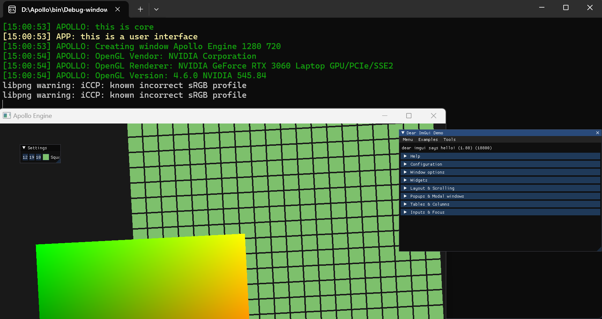

# Apollo

## My personal game engine!!!

### 使用方法
网址：https://github.com/vagrant051/Apollo

下载后运行GenerateProject.bat批处理文件自动生成visual studio解决方案

---

### 运行结果（更新于2024.5.14）

### 实现的功能：

1.通过键盘上的A键和D键来旋转相机

2.通过上下左右键来移动相机

3.通过调色板来改变小正方形集群的颜色

